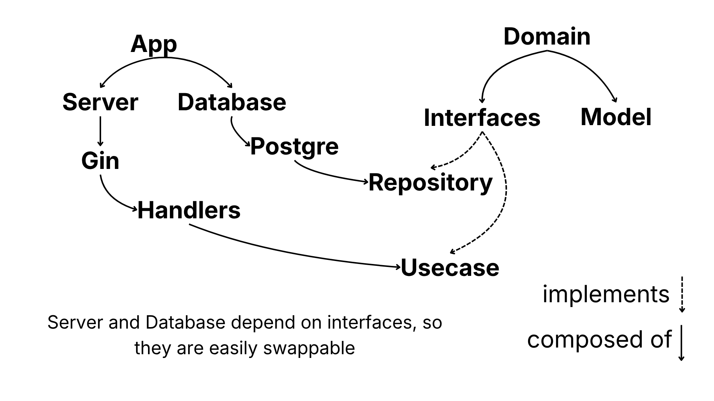
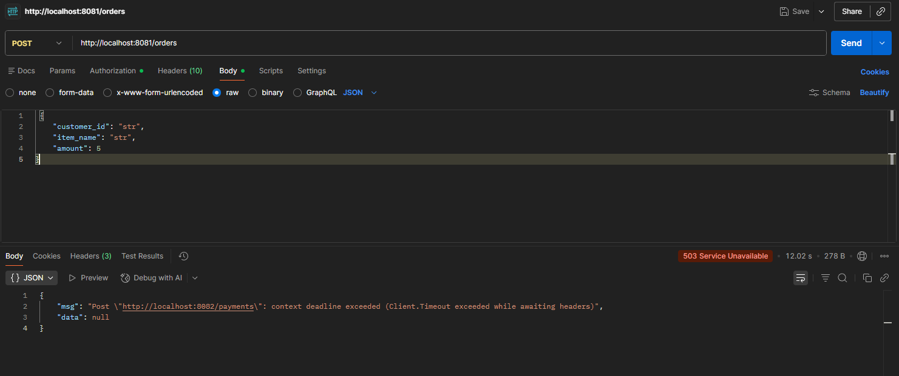
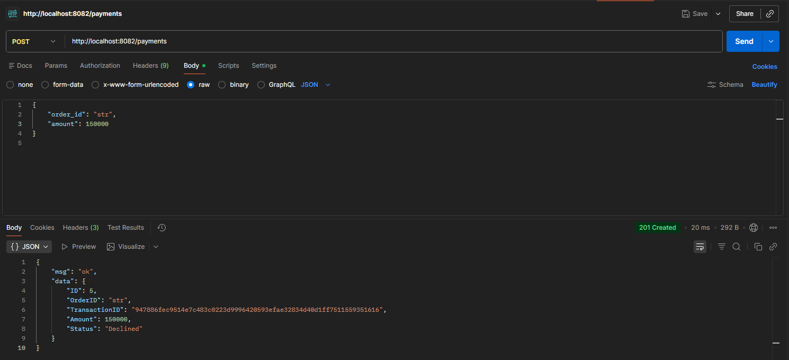

# architecture decisions
Project consists of two services; order and payment.

Both services use postgreSQL as their database, accessed using GORM library. 

Each service is implemented using the Gin framework and communicates with the other through REST APIs.

Http and database depend on interfaces, so for example; you can change Gin to any other web framework and postgreSQL to any other database.

```
service
├── cmd
│ └── main.go // entry point calls app.go
├── internal // src
│ ├── adapter
│ │      ├── http // everything about http
│ │      └── gorm // everything about databases
│ ├── app 
│ │    └── app.go // composition root
│ ├── domain // core models
│ │    ├── model.go // core model
│ │    └── model_interface.go // interfaces for dependency inversion principle
│ ├── middleware // middlewares 
│ ├── route // setting up routes
│ ├── usecase // business logic
│ └── util // utilities
├── migrations // migration
└── README.md
```

# bounded contexts
Each folder in the project only does his own respective only part. For example usecases for only business logic, http for only http, database(gorm) for only database actions. 

Each service is also doing his own part; order for ordering, payment for paying.

# failure handling
Errors are propogated from repositories up to http handlers, if an error occurs its automatically returned to the respective http handler and handled using custom response function.

# diagram


# api examples


